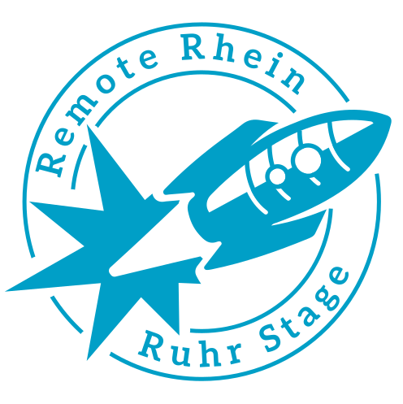
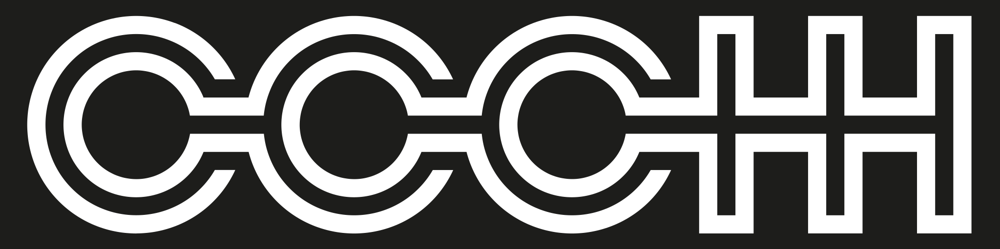

# [rC3 2021 - NOWHERE] Meta-Call for Participation
Entgegen aller Erwartungen, Hoffnungen und Wünsche gibt es auch dieses Jahr noch keinen Präsenz-Congress. Aber es wird aller Wahrscheinlichkeit auch keinen reinen remote Congress geben. Aber es wird keine Wiederholung vom letzten Jahr geben. Es wird eine Neuauflage sein, da es einen dezentralen (remote) Congress geben wird. Lokale Spaces werden Events hosten, es wird verteile (virtuelle) Bühnen geben.

Diese Bühnen werden von eigenständigen Channels betreut. Jeder dieser Channels hat ein eigenes Fachgebiet. Jeder dieser Channel hat einen eigenen Call for Participation (CfP).

In diesem Meta-CfP wollen wir uns als Channels vorstellen. Wir wollen euch aber auch unseren gemeinsamen Konsens über das, was wir auf dem rC3 2021 - NOWHERE wollen, transparent darlegen.

# Gemeinsame Spielregeln
Im Vorfeld haben wir uns auf gemeinsame [Spielregeln](https://c3voc.de/wiki/events:jahresendveranstaltung2021:call_for_productionplaces) geeinigt.  Diese Spielregeln betreffen alle Einreichungen in den Channels.

## Deadlines
Am **24. November um 23:42 Uhr** in der Zeitzone `Europe/Berlin` **endet das Zeitfenster für die Einreichungen** bei allen Channels.  Im Sinne des Fair Play wird es keine Ausnahmen geben.

Wir, also die Channels, werden die Einreichungen im nächsten Schritt sichten und euch dann bis zum **4. Dezember um 23:42 Uhr** über die Annahme oder Ablehnung informieren.

## Mehrfacheinreichungen
Es gibt eine Vielzahl von verschiedenen Channels - somit auch eine Vielzahl von Möglichkeiten, einen Beitrag einzureichen. Bitte gebt bei euren Einreichungen an, ob und bei welchen anderen Channels ihr euch beworben habt.

Die Channels werden dann gemeinsam entscheiden, welcher Channel euch hosten wird.

## Content-Kuration
Solltet ihr bei einem Channel einreichen und es stellt sich heraus, dass ein anderer Channel das Thema besser abdeckt, würden wir eure Einreichung an diesen Channel weitergeben.

Manchmal ergibt es sich auch, dass es zwei fast identische Vorträge gibt. In diesem Fall würden wir euch als Einreichende kontaktieren und euch eine Lösung (z.B. das Zusammenfassen) vorschlagen.

Wenn ihr eine solche Kuration nicht wünscht, schreibt es bitte explizit in eurer Einreichung dazu.

# Channels
Die in alphabetischer Reihenfolge sortierte Liste von Channels beschreibt das Konzept und die Themen in einem kurzen Absatz. Weitere Details finden sich jeweils im verlinkten CfP des Channels.

## rc1 / Main Track
Im Gegensatz zum letzten Jahr, wird es dieses Jahr keinen Main Track geben. Aus diesem Grund gibt es auch keinen dedizierten Call for Participation für einen Main Track.

## FeM
Soziale Probleme lassen sich durch Technik nicht lösen, sie kann aber helfen. Vom Home-Lab bis zum Hyperscaler, vom Piratensender bis zur hoch professionellen Medienanstalt und der LAN-Verkabelung Zuhause bis zu interkontinentalen Weitverkehrsnetzen interessieren wir uns für deine Einreichung zur Technik selbst, Ansätze diese kreativ zu nutzen, deren Einfluss auf unsere Gesellschaft, und warum bestimmte Dinge (eher nicht) getan werden sollten.

https://pretalx.c3voc.de/rc3-2021-fem/

## c-base

Das Leistungsspektrum des c-base-Channels bietet konzeptionelle Beratungsleistungen und operative Prozessdienstleistungen für umfassenden Know-How-Transfer in einer starken Wertschöpfungskette.

Ob live oder remote: Wir suchen Dich und deine Ideen für die gemeinsame Entwicklung von hochwertigem und nachhaltigem Content aus den Bereichen Art & Beauty, Gesellschaft und Netzpolitik!

Die Marke c-base, mit ihrer mehrstufigen innovativen Multiplikatorenplattform, ist ein Lösungsansatz, um sich gesellschaftliche Herausforderungen in einem breiten systemisch-lösungsorientierten Community-Beteiligungsprozess zu stellen. Dadurch vermeiden wir das übliche  "Bullshit-Bingo" und pflücken nicht nur tief hängende Früchte!

Nutze auch Du die Möglichkeiten, die Dir die größte Jahresendveranstaltung der europäischen Hackerszene zur Zusammenarbyte eröffnet und veröffentliche, in deinem ganz persönlich Zeitfenster, auf "c-base".

https://pretalx.c3voc.de/rc3-2021-cbase/cfp

## Chaos-West TV

"Back to the roots!"

Grundlagentalks über Technik, liebevolle Beiträge zu euren Nerd-hobbies, dystopische Träume von Tech-Konzernen zerschmettern oder versuchen Utopien wahr zu machen - für all das findest du bei uns Platz.

Auch dieses Jahr leider keine große Bühne auf dem Kongress, aber dafür haben wir ein physisches Studio in Ennepetal. Auf einem alten Industriegelände mit viel Platz für abgedrehte Ideen würden wir dich gerne bei uns sehen. Vor der Bühne werden nur eine handvoll Menschen Platz finden, wir übertragen aber in Echtzeit in das nebenliegende Hackcenter.

https://pretalx.c3voc.de/rc3-2021-cwtv/cfp

Logo: cwtv_logo_vektor.svg

## R3S

**R3S - Sharks in Cyberspace**

Wie im letzten Jahr haben wir bei der [RemoteRheinRuhrStage](https://r3s.nrw) wieder eine echte Bühne mit Licht-, Audio- und Streamingequipment. Wer also mal wieder [fast ;-)] echtes Bühnenfeeling spüren möchte, kommt gerne zu uns in die Aula der Volkshochschule nach **Monheim am Rhein**. Monheim liegt verkehrsgünstig zwischen den beiden Großstädten Köln und Düsseldorf.

Fühlt Euch herzlich eingeladen, wenn Ihr etwas zu **Opensource, Datensicherheit** oder **Nachhaltigkeit** zu sagen, zeigen, basteln habt. Natürlich interessieren uns aber auch alle anderen Cyber-Themen, die Ihr zu uns tragt.

Ihr könnt euren Beitrag **live vor Ort** in Monheim am Rhein oder **Remote per Videokonferenz** halten. Ihr könnt den Vortrag natürlich auch vorher **aufzeichnen**, aber wir hätten gerne eine Live-Diskussion mit dem Publikum.

CfP: https://pretalx.c3voc.de/rc3-2021-r3s/

## Chaosstudio Hamburg – We feel homesick for the future

Wir haben Heimweh nach der Zukunft. Aus diesem Grund lädt das Chaosstudio Hamburg im Rahmen der [rC3](https://rc3.world) zur Beteiligung ein.

Wir freuen uns über Beiträge zu Wissenschaft und Technik, gerne auch mit regionalem Bezug. Oder künstlerische Beiträge wie Performances, Video Art, oder eine virtuelle Ausstellung? Ihr habt Inhalte, wir haben eine Bühne.

Bitte sucht aus: einen Vortrag mit 30 Minuten Länge (plus Diskussion), oder einen Lightning Talk mit max. 10 Minuten. Für euer Kunstprojekt haben wir auf Wunsch auch flexible Zeitslots.

Ihr könnt euren Beitrag live vor Ort in Hamburg in den Räumen des Chaos Computer Club Hamburg oder Remote per Videokonferenz halten. Ihr könnt den Vortrag natürlich auch vorher aufzeichnen, aber wir hätten gerne eine Live-Diskussion mit dem Publikum.

Bitte sendet euren Vorschlag [im Konferenz-Management-System](https://pretalx.c3voc.de/rc3-2021-chaosstudiohamburg/cfp) bei uns ein. Be excellent to each other!

## ChaosZone TV

Liebe Reisende,

in einem wohlbekannten Land, vor gar nicht all zu langer Zeit fanden zwischen Weihnachten und Silvester Lebensformen zusammen, um zu berichten. Von guten und von schlechten Taten, von ihren Plänen und ihren Träumen. Geschichte wurde zur Legende, Legende wurde Mythos. Und zwischen flimmernden Schatten auf Bildschirmen in der Farbe eines Fernsehers, der auf einen toten Kanal geschaltet war …

HALT. Da geht noch was.

Auch wenn wir uns schon wieder nicht in Leipzig treffen können, wird euch die ChaosZone eine Bühne für eure Vorträge, Projekte und Kunst-Performances bieten. Die Produktionskapazitäten des ChaosZone TV Hauptstadtstudios in Halle sind gesichert und die Werktätigen des CCCP arbeiten bereits unermüdlich an der Vorbereitung einer dezentralen Veranstaltung mit Bühne in Potsdam.

https://pretalx.c3voc.de/rc3-2021-chaoszone/cfp

## franconian.net

[franconian.net](https://franconian.net), ein Zusammenschluss fränkischer Hackspaces ([Hackzogtum Coburg e.V.](https://hackzogtum-coburg.de), [Nerd2Nerd e.V.](https://nerd2nerd.org) und [backspace e.V.](https://hackerspace-bamberg.de)), lädt euch ein, eure Vorschläge für interessante Vorträge/Workshops/Sonstiges noch **bis zum 23.11.2021 um 23:42 Uhr CET** in unseren [Call for Participation (CfP)](https://cfp.franconian.net/end-of-year-event-2021/cfp) einzubringen.

Du hast ein interessantes Projekt, das du anderen Hacker\*innen vorstellen möchtest? Gerne kannst du bei uns einen Vortrag einreichen!

Du hast Erfahrung mit $Tool, $Programmiersprache, etc.? Halte doch einen Workshop darüber, um anderen Menschen eine Einführung zu geben und/oder sie dafür zu begeistern.

Wir bieten euch die Möglichkeit, euren Beitrag in unserem "Studio" in Bamberg zu präsentieren – vorbehaltlich einer dies zulassenden Situation zwischen Weihnachten und Silvester. In jedem Fall wird es möglich sein, von zu Hause aus per Webcam zugeschaltet zu werden. Das Publikum wird abgesehen von den vor Ort zum Betrieb der Technik anwesenden Menschen ausschließlich per Livestream zuschauen.

## about:future / hackers against climate change München
Was tun, während die Klimakrise weiter geht? Wo lässt sich ansetzen, und wie? An welchen Orten können Alternativen geschaffen werden – zum unentrinnbaren Straßenverkehr, zu nicht Recycle- oder Reparierbarem, zu Weltanschauungen, die von vornherein jede Veränderung als unmöglich betrachten? Und wie könnten die aussehen?
Auch diesen Remote-Congress möchten wir ([hackers against climate change München](https://muc.hacc.earth/)) als Teil des about:future Clusters diesen Fragen eine Bühne geben.

⚠ Achtung: Aus Kapazitätsgründen können wir leider nur ein kleines Programm mit Beiträgen livegestreamt von unserem lokalen Studio vor Ort in München umsetzen. Bitte versichert, dass ihr irgendwann vom 27.-30. da sein könnt. Reicht euren Beitrag gerne auch bei anderen Channels ein.

[Zum CfP / Go to CfP](https://pretalx.c3voc.de/rc3-2021-hacc-a-f/cfp)

## Sendezentrum

Im Sendezentrum wird es ein Programm mit Live-Podcasts und Vorträgen zu Podcasting-Themen geben. Das Sendezentrum ist virtuell, es gibt keine Präsenzbühne. https://sendegate.de/t/sendezentrum-rc3-2021-call-for-participation-live-podcasts-talks-workshops/14536

## haecksen

["Just another day in Paradise"](https://events.haecksen.org/), so lautet das Motto, unter welchem die [Haecksen](https://www.haecksen.org/) mit euch das Jahr 2021 ausklingen lassen. Um das Jahresendevent auch wirklich zu einem Paradis zu machen, brauchen wir dich, deine Ideen, deine Kreativität oder dein Know-How. Deshalb reiche deinen Talk, Workshop, Lightning-Talk oder Panel bei unserem CfP ein.

https://pretalx.c3voc.de/rc3-2021-haecksen/cfp

Hast du vorab Fragen oder bist dir nicht sicher, ob deine Idee reinpasst - melde dich einfach bei uns unter event-orga2021[at]lists.haecksen.org.

## xHain hack+makespace
gehacktes from hell

...oder: Leben auf dem Land
In unserem Kanal beschäftigen wir uns mit allem, was Leute auf dem Land beschäftigt. Von Verkehrsanbindung, über politische Partizipation und Gleichberechtigung zu Klimawandel und Digitalisierung. Dabei wollen wir über den Tellerrand der Dorfgrenze hinaus in die Welt schauen, uns aber auch um die Herausforderungen kümmern, vor denen eine Stadtbevölkerung nicht steht.

Der xHain öffnet seine Türen für den rc3.rev2!
Wir freuen uns darauf, euch unter unseren Bäumen begrüßen zu dürfen.
Dachtest du, dass du deine Ideen nicht mit einem Publikum teilen kannst, weil es keinen zentralen ChaosCommunicationCongress gibt? Du arbeitest an einem coolen Projekt und möchtest es bekannt machen? Hast du einen tollen Hack gefunden, den du mit anderen Menschen teilen willst? Du hast etwas kaputt gemacht und es sind spannende Dinge dabei passiert? Dann reich deinen Talk ein!
Zwischen Bäumen und unter leuchtenden Wolken findet ihr die Lichtung - unsere Bühne für eure Gespräche und Diskussionen.
Ob (Netzwerk-)Politik, ökologische Themen, Präsentation der neuesten Sicherheitsthreads oder spannende Hack+Make-Projekte – wir freuen uns auf eure Einreichungen.
Es gibt genügend Platz für Workshops und die Grundausstattung wie Lötkolben, 3D-Drucker etc. ist auch vorhanden und kann genutzt werden.

* Nur Online-Einreichungen
Alle Vortragsvorschläge werden über unser Konferenz-Planungssystem eingereicht, das sich unter folgender Adresse befindet: [CfP](https://pretalx.c3voc.de/rc3-2021-xhain/cfp?).

# [rC3 2021 - NOWHERE] Meta-Call for Participation

Against all our expectations, wishes and dreams, there won't be an in-person Congress again this year. But in all likelyhood, it won't be a fully remote Congress either. And it won't be just a repeat of last year. It's going to be a new de-centralized (remote) Congress, with local spaces hosting events and distributed stages.

The stages are managed by individual channels. Each channel has their own focus. Each channel has their own Call for Participation.

In this Meta CfP, we're presenting all of the channels. We also want to make transparent what we want to present at rC3 - NOWHERE.

# Common Rules
We have agreed on some common [rules](https://c3voc.de/wiki/events:jahresendveranstaltung2021:call_for_productionplaces). These apply to any submission to all channels.

## Deadlines
The **content submission deadline** is **24th November at 23:42**  `Europe/Berlin`. In the interest of fair play, there will be no exceptions.

In the next step, we, the channels, will review the submissions, and will let you know about acceptance or rejection by **4th December at 23:42**.

## Multiple Submissions
There are a lot of channels and thus there are a lot of possibilities to submit content. Please state with your submission to which channels you are submitting your content.

In case of multiple submissions there will be a decision as to which channel will host you.

## Content Curation
If you submit to one channel but the content team of that channel determines that another channel might better suit your talk, we will forward to your submission to the matching channel. If there are two nearly identical submissions on different channels, we might ask you to merge them.

If you would rather not be subject to this curation, please state so in your submission.

# Channels
The following list of channels is sorted by chaos and magick and presents the channels and their topics. You'll find further inforation in the linked CfPs.

## RC1 / Main Track
In contrast to last year, there will be no dedicated channels as main track. Thus, there won't be any Call for Participation for a main track at rC3 2021 NOWHERE.

## FeM
Social problems cannot be solved by technology, but technology can help. From home labs to hyperscaler, from pirate radio stations to the highly professional media agencies and from home LAN cabling to intercontinental networks, we are interested in your submissions on technology itself, approaches to using it creatively, its influence on our society, and why certain things should (rather not) be done.

https://pretalx.c3voc.de/rc3-2021-fem/

## c-base

The spectrum of the c-base channel service offers includes conceptual consulting services and operational process services for comprehensive know-how transfer in a strong added-value chain.

Whether live or remote: We are looking for you and your ideas for the joint development of high-quality and sustainable content from the fields of art & beauty, society and internet politics!

The c-base brand, with its multi-level innovative multiplier platform, is a problem-solving approach to address societal challenges in a broad systemic solution-oriented community participation process. We avoid the usual "bullshit bingo" and we don't only pick the low-hanging fruits!

Take advantage of the opportunities that the biggest end-of-the-year event of the European hacker scene opens up for you and publish on "c-base" in your own personal time slot.

https://pretalx.c3voc.de/rc3-2021-cbase/cfp

## Chaos-West TV

"Back to the roots!"

Introductory talks about tech-things, fancy science foo explained, also for mere mortals without a PhD, or just a heartfelt presentation of your weird Nerd-hobby will finmd a home here.

Sadly this year we don't have a big stage at the Congress, but rather a physical studio in Ennepetal. We would love to have you with us on this old industrial location with lots of space for crazy ideas. There will be just a handfull of seats in front of the stage, but we'll transmit in realtime to the Hackcenter in the next building.

https://pretalx.c3voc.de/rc3-2021-cwtv/cfp

Logo: cwtv_logo_vektor.svg

## R3S

**R3S - Sharks in Cyberspace**.

Like last year, we will have at the [RemoteRheinRuhrStage](https://r3s.nrw) a real venue with lighting, audio and streaming equipment. So if you want to have [almost ;-)] real stage feeling again, you are welcome to join us in the auditorium of the Volkshochschule in **Monheim am Rhein**. Monheim is located between the two big cities Cologne and Düsseldorf easily reachable by public transport.

Feel invited if you have something to say, show, tinker to **Open source**, **Data Security** or **Sustainability**. Of course we are also interested in all other cyber topics you bring to us.

CfP: https://pretalx.c3voc.de/rc3-2021-r3s/

## Chaosstudio Hamburg – We feel homesick for the future

We feel homesick for the future. For this reason, Chaosstudio Hamburg invites you to participate in [rC3](https://rc3.world).

We're looking forward to your contribution from the fields of science or technology, especially if it is connected to the Hamburg region. Or artistic contributions like performances, video art, or a virtual exhibition? You have the content, we have the stage.

Please choose: a talk/lecture 30 minutes in duration (plus q&a), or a lightning talk up to 10 minutes long. For your art project, we offer flexible time slots.

You can present your contribution live on location at Chaos Computer Club Hamburg or remotely via video conference. You can also pre-record your talk, but we would like to have a live q&a with the audience.

Please send your proposal [through the conference management system](https://pretalx.c3voc.de/rc3-2021-chaosstudiohamburg/cfp). Be excellent to each other!

## ChaosZone TV
Dear travelers,

in a well known place, not long in the past, between Christmas and New Year's Eve, life forms came together to tell stories. Of good and of bad deeds, of their plans and their dreams. History became legend, legend became myth. And between flickering shadows on screens the color of television tuned to a dead channel ...

STOP. There's still something here.

Even if we once again can't meet in Leipzig, the ChaosZone will offer you a stage for your talks, projects and art performances. The production capacities of the ChaosZone TV capital studio in Halle are secured and the working people of the CCCP are already tirelessly preparing a decentralized event with a stage in Potsdam.

https://pretalx.c3voc.de/rc3-2021-chaoszone/cfp

## franconian.net
[franconian.net](https://franconian.net), a cluster of several franconian hackspaces (namely [Hackzogtum Coburg e.V.](https://hackzogtum-coburg.de), [Nerd2Nerd e.V.](https://nerd2nerd.org) and [backspace e.V.](https://hackerspace-bamberg.de)), invites you to submit your proposals for interesting talks, workshops and other performances **until 23rd of November 2021 at 23:42 CET** (that's **22:42 UTC**) to [our Call for Participation (CfP)](https://cfp.franconian.net/end-of-year-event-2021/cfp).

You've got some interesting project that you want to show others? Enter your talk into our CfP now!

There's $tool or $programming_language you have some experience in using? Teach people about it in a workshop!

You may come to our "studio" in Bamberg if the situation between Christmas and New Year's permits it. In any case, there will be the possibility to join us from home with your webcam. The audience is going to be exclusively remote via live stream.

## about:future / hackers against climate change München
What to do, while the climate crisis continues? Where to start, and how? Where can we build alternatives — to inescapable car traffic, to non-recycable or non-repariable things, to ideologies that will always dismiss any kind of change as impossible? And how might these look like? As on last year's rc3 we want to offer these topics a stage as part of the about:future cluster.

⚠️ We are a relatively small team who will run a relatively small programme, and unfortunately we don't have the capacity to run a wholly remote stage as well, so everything will be live-streamed from our local studio in Munich. Please make sure you can be there for your talk (sometime during Congress, i.e. between 27 and 30 December), and consider also submitting your idea to other channels.

## Sendezentrum
The Sendezentrum will offer a program of live podcasts and talks on podcasting topics. The Sendezentrum is virtual only, there is no presence stage. https://sendegate.de/t/sendezentrum-rc3-2021-call-for-participation-live-podcasts-talks-workshops/14536

## haecksen
["Just another day in Paradise"](https://events.haecksen.org/) is the motto under which the [Haecksen](https://www.haecksen.org/) will end the year 2021 with you. To make the year-end event really a paradise, we need you, your ideas, your creativity or your know-how. Therefore, submit your talk, workshop, lightning talk or panel to our CfP.

https://pretalx.c3voc.de/rc3-2021-haecksen/cfp

If you have any questions in advance or if you're not sure whether your idea fits, just contact us at event-orga2021 [at] lists.haecksen.org.

## xHain hack+makespace
gehacktes from hell

...or: Life in the countryside
In our channel we deal with everything that concerns people in the countryside. From transport connections, political participation and equal rights to climate change and digitalization. In doing so, we want to look beyond the village borders into the world, but also take care of the challenges that an urban population does not have to deal with.

xHain will be opening its doors for the rc3.rev2!
We look forward to welcoming you under our trees.
Do you think that because there's no central ChaosCommunicationCongress you won't be able to share your ideas in front of a audience? Do you work on a cool project and want to get the word out? Did you come up with an awesome hack that
you need to share? Did you break something and exciting things happened in the process?
Go ahead and enter your lecture now!
Between trees and under glowing clouds you'll find the 'Lichtung' (clearing) - our stage for your talks and discussions.
Whether (network) politics, ecological topics, presentation of the latest security threats or exciting hack + make projects - we look forward to your submission.
There is enough space for workshops and the basic equipment, such as soldering iron, 3D printer, etc., is also there and can be used.

* Online submissions only
All presentation proposals are submitted via our conference planning system, which is located at the following address: [CfP](https://pretalx.c3voc.de/rc3-2021-xhain/cfp?).
